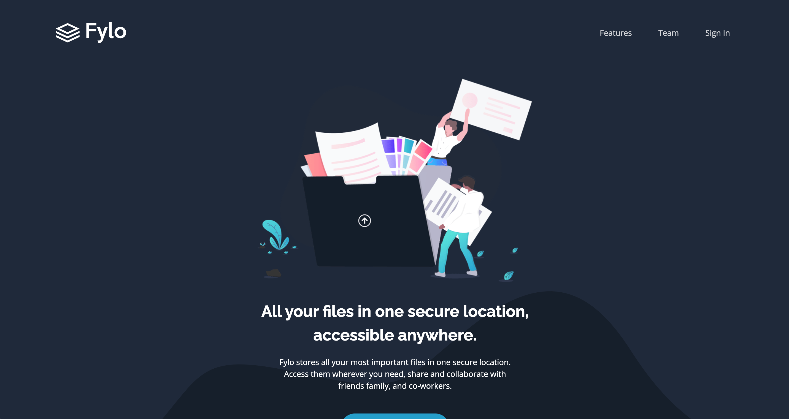
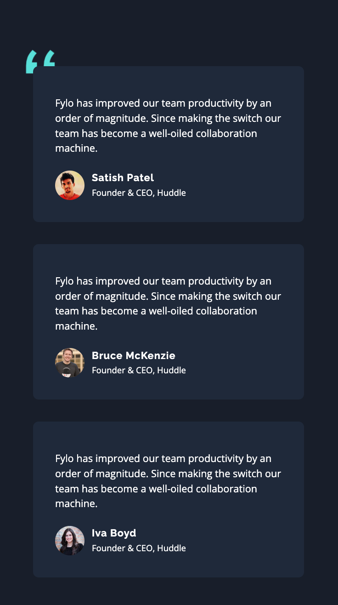

# Frontend Mentor - Fylo dark theme landing page solution

This is a solution to the [Fylo dark theme landing page challenge on Frontend Mentor](https://www.frontendmentor.io/challenges/fylo-dark-theme-landing-page-5ca5f2d21e82137ec91a50fd). Frontend Mentor challenges help you improve your coding skills by building realistic projects.

## Table of contents

- [Overview](#overview)
  - [The challenge](#the-challenge)
  - [Screenshot](#screenshot)
  - [Links](#links)
- [My process](#my-process)
  - [Built with](#built-with)
  - [What I learned](#what-i-learned)
- [Author](#author)

## Overview

### The challenge

Users should be able to:

- View the optimal layout for the site depending on their device's screen size
- See hover states for all interactive elements on the page

### Screenshot

### Links

- Solution URL: [https://www.frontendmentor.io/solutions/responsive-landing-page-using-grid-and-flexbox-AJHb7NxAIz](https://www.frontendmentor.io/solutions/responsive-landing-page-using-grid-and-flexbox-AJHb7NxAIz)
- Live Site URL: [https://mbalinoftw.github.io/fylo-dark-theme-landing-page/](https://mbalinoftw.github.io/fylo-dark-theme-landing-page/)

## My process

### Built with

- [ViteJS](https://vitejs.dev/)
- [TailwindCSS](https://tailwindcss.com/)

### What I learned

- Reinforcement of Grid and Flexbox layouts.
- Relative and absolute positioning.
- Active states (hover, active).
- Deploying to GithubPages.

## Author

- Frontend Mentor - [@mbalinoftw](https://www.frontendmentor.io/profile/mbalinoftw)
- GitHub - [@mbalinoftw](https://github.com/mbalinoftw)
